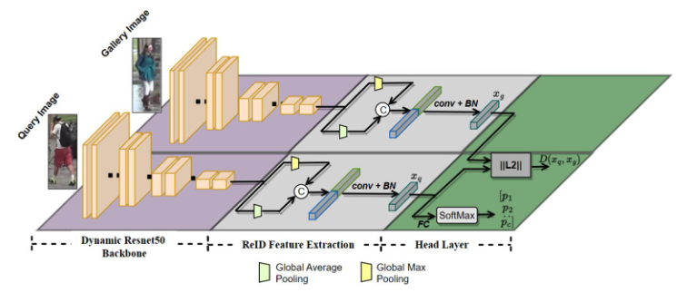
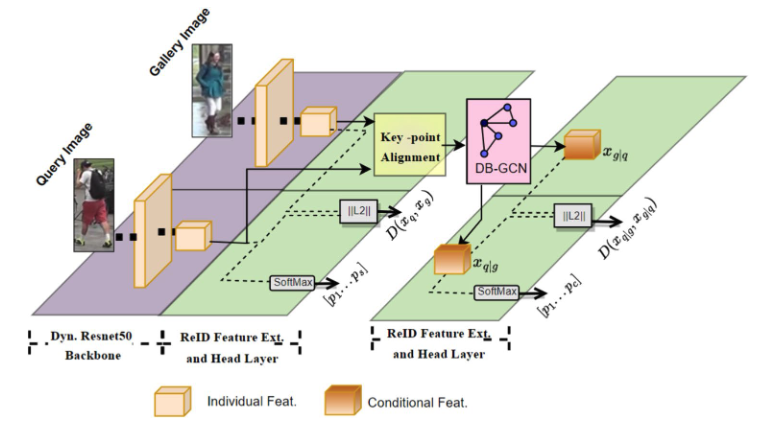
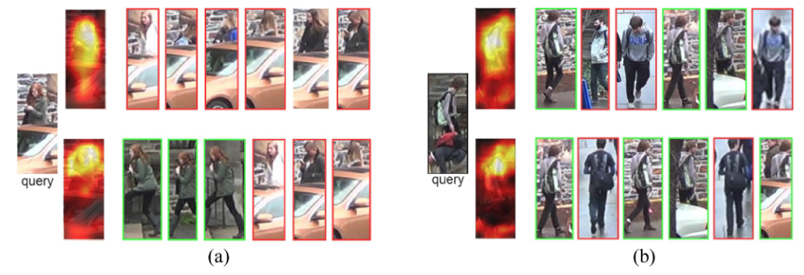

# Boosting Person ReID Feature Extraction via Dynamic Convolution

This repository contains the implementation of the paper **“Boosting Person ReID Feature Extraction via Dynamic Convolution.”**

**Paper:** [Pattern Analysis and Applications](https://doi.org/10.1007/s10044-024-01294-9)

The proposed approach improves person re-identification by replacing the conventional static ResNet-50 backbone with a dynamic convolutional backbone **DY-ResNet50**. The dynamic backbone adaptively changes its convolution kernels according to the input image and performs channel-wise attention and channel fusion to extract more discriminative features.

Two dynamic person ReID networks are provided:

- **DY-BL:** A lightweight ReID network that performs query-gallery matching using global feature embeddings.
- **DY-Cace:** A more advanced ReID network that combines global and conditional feature embeddings.

## Network Architectures

### DY-BL

DY-BL employs the proposed DY-ResNet50 backbone to extract feature maps from query and gallery images. Global average pooling and global max pooling are applied to obtain the final global feature embeddings. These embeddings are used for identity classification and query-gallery matching.

<p align="center">
  
</p>

### DY-Cace

DY-Cace extends the global feature extraction pipeline by incorporating key-point alignment and a discrepancy-based graph convolutional network. In addition to individual global features, the network extracts conditional feature embeddings based on correspondences between query and gallery images.

<p align="center">
  
</p>

## Re-identification Results

The figure below presents re-identification examples from the Occluded-DukeMTMC dataset.

For each query image:

- The first row shows the feature embedding extracted by the static ResNet-50 backbone and the first six matching results obtained by the static baseline.
- The second row shows the feature embedding extracted by DY-ResNet50 and the first six matching results obtained by DY-BL.
- Green boxes indicate correct matches.
- Red boxes indicate incorrect matches.

<p align="center">
  
</p>

## Pretrained Models

The trained DY-BL and DY-Cace models for four person ReID datasets can be downloaded from:

[Download trained models from Google Drive](https://drive.google.com/drive/folders/1pOOo2Wq5h01kTiivesA6KLuQIGfcUzs0?usp=sharing)

For training, download the DY-ResNet50 model pretrained on ImageNet and place it in the `pretrained_models/` directory:

[Download the ImageNet-pretrained DY-ResNet50 model](https://drive.google.com/drive/folders/16O3ncmayQI6HPaX32zfn13lz6_t_hme6?usp=sharing)

The expected structure is:

```text
BoostingPersonReID/
├── pretrained_models/
│   └── <ImageNet-pretrained DY-ResNet50 model>
├── BaseTrainer.py
├── config.yaml
├── core/
├── dataset/
├── example/
├── models/
├── tools/
└── utils/
```

## Datasets

The proposed networks were evaluated on the following person re-identification datasets:

- [Market-1501](https://www.v7labs.com/open-datasets/market-1501)
- [CUHK03](http://www.ee.cuhk.edu.hk/~xgwang/CUHK_identification.html)
- [DukeMTMC-reID](https://exposing.ai/duke_mtmc/)
- [Occluded-DukeMTMC](https://github.com/lightas/Occluded-DukeMTMC-Dataset)

Download the required datasets and update their paths in the corresponding configuration files.

## Configuration Files

Configuration files are provided under the `example/` directory:

```text
example/
├── baseline/
│   ├── baseline_dist_bn.yaml
│   ├── baseline_large_multidataset.yaml
│   ├── baseline_lite_multidataset.yaml
│   └── baseline_medium_multidataset.yaml
└── cacenet/
    └── cacenet.yaml
```

The baseline configuration files can be used for the DY-BL architecture, while the CaceNet configuration files correspond to the DY-Cace architecture.

Before training or inference, update the following paths and settings where necessary:

- Dataset directories
- ImageNet-pretrained DY-ResNet50 model
- Trained model checkpoint
- Output directory
- Batch size and training parameters

## Repository Structure

```text
BoostingPersonReID/
├── BaseTrainer.py
├── config.yaml
├── core/
│   ├── __init__.py
│   ├── config.py
│   ├── feature_extractor.py
│   ├── layers.py
│   └── loss.py
├── dataset/
│   ├── OccludedData.py
│   ├── formatdata.py
│   ├── pedes.py
│   └── testdata.py
├── example/
│   ├── baseline/
│   ├── cacenet/
│   └── docs/
├── images/
│   ├── DY-BL_architecture.png
│   ├── DY-Cace_architecture.png
│   └── matching_results.png
├── models/
│   ├── backbones/
│   │   ├── resnet.py
│   │   ├── resnet_dy.py
│   │   ├── resnet_ibn_a.py
│   │   └── senet.py
│   ├── baseline.py
│   ├── cacenet.py
│   ├── mgn.py
│   ├── nafs.py
│   ├── pcb.py
│   └── pyramid.py
├── tools/
├── utils/
├── LICENSE
└── README.md
```

## Reference Implementations

The DY-BL and DY-Cace implementations build upon the Baseline and CaceNet person ReID models provided in:

[PersonReID-YouReID](https://github.com/TencentYoutuResearch/PersonReID-YouReID)

The dynamic convolutional backbone is based on the implementation provided in:

[Dynamic Convolution Decomposition](https://github.com/liyunsheng13/dcd)

## Citation

Please cite the following paper when using this code:

```bibtex
@article{akbaba2024boosting,
  title={Boosting person ReID feature extraction via dynamic convolution},
  author={Akbaba, Elif Ecem and Gurkan, Filiz and Gunsel, Bilge},
  journal={Pattern Analysis and Applications},
  volume={27},
  number={3},
  pages={80},
  year={2024},
  publisher={Springer}
}
```
